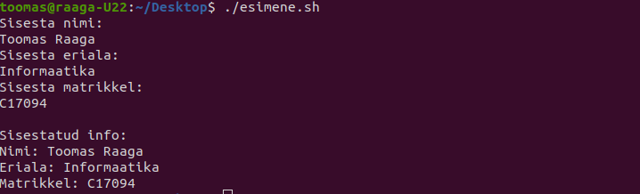
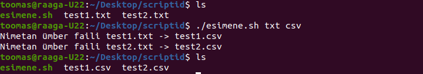
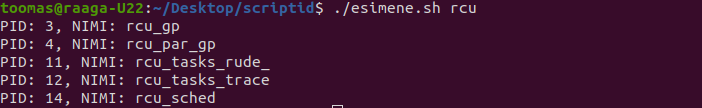
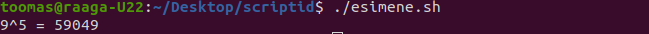

**Ülesanne 3**

```
#!/bin/sh

echo "Sisesta nimi:"
read nimi

echo "Sisesta eriala:"
read eriala

echo "Sisesta matrikkel:"
read matrikkel

echo ""
echo "Sisestatud info:"
echo "Nimi: $nimi"
echo "Eriala: $eriala"
echo "Matrikkel: $matrikkel"
```




**Ülesanne 4**

```
#!/bin/sh

for i in $(ls)
do
    if [ ${i##*.} = $1 ]
    then
        echo "Nimetan ümber faili $i -> ${i%.*}.$2"
        mv $i ${i%.*}.$2
    fi
done
```




**Ülesanne 5**

```
#!/bin/sh
IFS=$'\n'

for i in $(ps -A | grep $1)
do  
    echo $i | awk '{print "PID: " $1 ", NIMI: " $4}'
done
```




**Ülesanne 6**

```
#!/bin/bash

aste () {
    a=$1
    b=5
    while [ $b -gt 1 ]
    do
        a=$(($a*$1))
        b=$((b-1))
    done
    echo "$1^$2 = $a"
}

echo $(aste 9 5)
```

